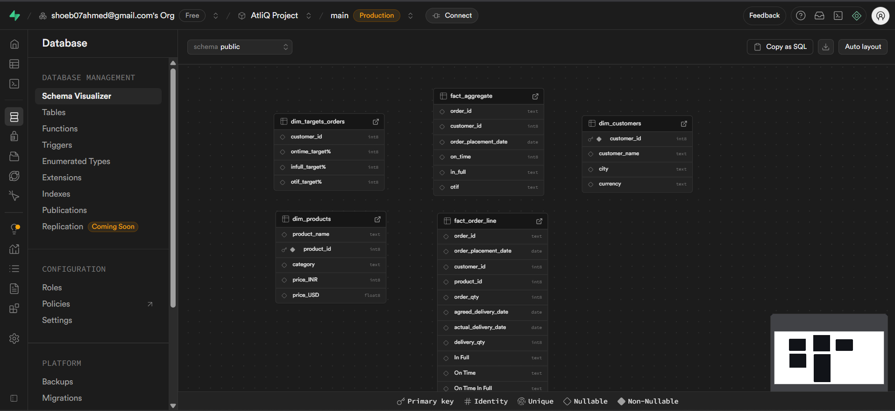

# 📊 Data Analysis using AI Tools (n8n, Quadratic)

## 🚀 Project Overview

This project showcases a complete end-to-end analytics pipeline using **AI-powered tools** like **n8n and Quadratic**, tailored for a **supply chain** use case.

With email automation, PostgreSQL data storage, and AI-driven spreadsheets, this project demonstrates how to build scalable, intelligent data solutions without writing code from scratch.

Inspired by [Codebasics](https://www.youtube.com/watch?v=PglKAYgRdJ4&ab_channel=codebasics).

---

## 🛠️ Tools Used
- **n8n** – Agentic workflow automation (email → JSON → PostgreSQL)
- **Supabase** – PostgreSQL cloud DB
- **Quadratic** – AI-powered spreadsheet
- **OpenExchangeRates** – For USD to INR conversion
- **Python via AI** – Used inside Quadratic prompts

---

## 🔄 Workflow Summary

### 1️⃣ Data Acquisition

Sales data from **daily emails** in the form of CSVs.

---

### 2️⃣ Email Automation with n8n

- Monitored Gmail for specific subjects
- Extracted CSV attachments
- Converted to JSON format

---

### 3️⃣ PostgreSQL Integration via Supabase

- Connected n8n to a cloud PostgreSQL DB
- Used JSON output to populate fact and dimension tables

---

### 4️⃣ Execution Sample

- Before execution  
  

- Executing workflow  
  

- Final Result  
  

---

### 5️⃣ Quadratic Integration

- Connected to PostgreSQL using Supabase credentials
- Pulled data into individual sheets

---

### 6️⃣ Creating Auxiliary Tables via AI Prompts

- `Dim Date` and `Exchange Rates` created using natural language prompts

---

### 7️⃣ Final Data Cleaning and Summary Table

- Merged fact & dimension tables
- Currency conversion applied
- AI-generated Python cleaned and transformed the data

---

## 📌 Key Learnings

- AI tools like **n8n** and **Quadratic** reduce manual coding.
- However, **core skills in Python, SQL, and data modeling** are essential to:
  - Debug AI hallucinations
  - Improve prompt quality
  - Validate logic and results

---

## 📸 Supabase ER Diagram

---

## 📂 License

MIT License – Free to use and modify.

---

## 🙌 Acknowledgment

Built with guidance from the **Codebasics community**.
